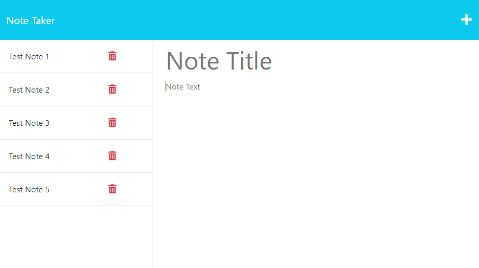

# note-taker

## Description

This Note Taker is an application that was created with JavaScript, Node and express.js and will allow the user to create, store and delete notes.

## Usage

- Click on the "Get Started" button
- On the notes page, add a title for the note and a note
- To save the note, click the save icon
- To delete a note, click the trashcan icon next to the note you wish to delete

Link to deployed application on Heroku:
[Note Taker Application](https://mysterious-island-53745-682eedebbb58.herokuapp.com/)

## License
MIT License

## How to Contribute

Please visit [my GitHub](http://www.github.com/shanna-not-shawna) or [email me](mailto:shanna.d.brooks2012@gmail.com) me with any questions, or if you'd like to contribute.